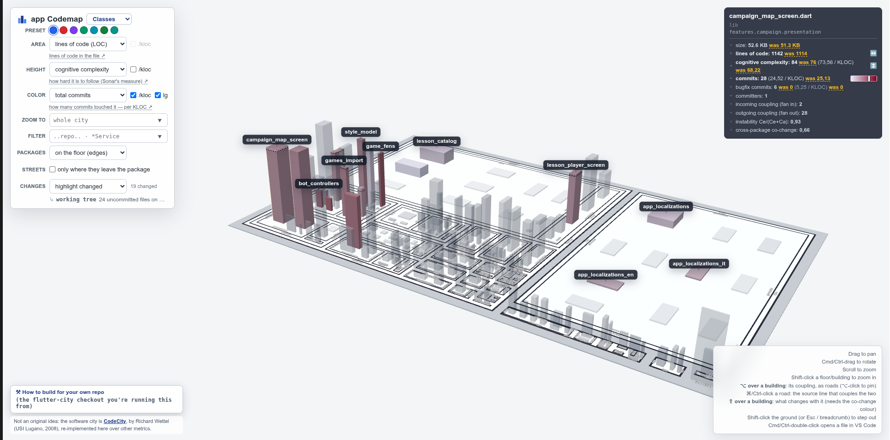

# flutter-city

Turn any folder of Dart/Flutter sources into a 3-D city: one building per file,
districts per package, height and colour driven by whatever metric you pick —
complexity, churn, coupling. Same idea as
[code-city](https://github.com/victorrentea/code-city), retargeted from Java at
Dart/Flutter.

Output is a single self-contained HTML file — data inlined, libraries from a CDN, no
server. Mail it, publish it on Pages, open it from disk.



## Quick start

```bash
git clone <this repo> ~/flutter-city
~/flutter-city/generate.sh ~/workspace/your-flutter-repo
open ~/workspace/your-flutter-repo/.flutter-city/codecity.html
```

That's the whole configuration: the repo to analyse. First run vendors
`tree-sitter-dart` into `.pylibs/` (needs `python3`, `pip3`, `git`); later runs skip it.
`generate.sh REPO OUT` also takes an explicit output directory. Output lands in
`REPO/.flutter-city/`:

| File | What it is |
| --- | --- |
| `codecity.html` | the 3-D city (Three.js) |
| `codemap.html` | the 2-D treemap + scatter (Plotly) |
| `combined.html` | both, side by side, hover-linked |
| `*.tsv` | the raw measurements, if you want to plot your own |

## What each metric means

| Metric | Source | Needs |
| --- | --- | --- |
| Cognitive complexity | `tree-sitter-dart`, Sonar-style | nothing — read off the sources |
| Fan-in / fan-out | Dart `import`/`export` resolution | nothing |
| Commits, bug-fix commits, co-change | `git log` | nothing |
| Line coverage | `coverage/lcov.info` | `flutter test --coverage` run first |
| Dead code | [`dead_code_analyzer`](https://pub.dev/packages/dead_code_analyzer) | the tool on PATH |

Coverage and dead code are absent, not zero, when their input is missing — the city
still builds in a couple of seconds, just without those two colours in the dropdown.
CRAP (complexity-weighted coverage risk) is not computed: it needs a per-method
complexity counter that `lcov` doesn't carry (JaCoCo, which code-city's Java version
reads, does). `crap-per-file.tsv` still gets written with real coverage columns and
zeroed CRAP ones, so the renderer needs no branching for its absence — see the header
comment in `compute_crap.py`.

Set `GITHUB_TOKEN` or `GH_TOKEN` and the analysed repo's `origin` pointing at
`github.com` to also crawl its `type: bug`/`type: regression` issue labels for a more
precise bug signal than the commit-subject heuristic alone. Opt-in — GitHub's search API
caps unauthenticated callers at 10 req/min.

## Pipeline

| Step | Script | Produces |
| --- | --- | --- |
| 1 | `compute_complexity.py` | `complexity-per-{class,file}.tsv` |
| 2 | `compute_fanio.py` | `fanio-per-file.tsv`, `coupling-edges.tsv` |
| 3 | `compute_crap.py` | `crap-per-file.tsv` |
| 4 | `compute_deadcode.py` | `deadcode-per-file.tsv` |
| 5 | `fetch_bugs.py` | `bug_issues.txt` (only if `GITHUB_TOKEN`/`GH_TOKEN` is set) |
| 6 | `build_heatmap.py` | `codemap.tsv`, `codemap-{packages,modules}.tsv`, `cochange-edges.tsv` |
| 7 | `render_heatmap.py`, `render_codecity.py`, `render_combined.py` | the three HTML pages |

### Which files are in the city

`git ls-files`, filtered to non-test `.dart` (nothing under `test/` or
`integration_test/`), no generated files (`*.g.dart`, `*.freezed.dart`, `*.mocks.dart`,
`*.gr.dart`). Not a walk of the folder — the repo's own `.gitignore` already knows what's
noise, so this reuses that answer instead of keeping a second, driftable list. See
`repo_files.py`.

## Dev tools

Not part of the pipeline, run by hand against a generated page:

- `./profile_city.py page.html "label"` — time to first frame, draw calls per frame, idle
  and panning frame rate.
- `./hover_cost.py page.html "label"` — the cost of one hover, timed inside the handler.

Both need `pip install playwright && playwright install chromium`.

## Known gaps vs. code-city

- No `test_render_codecity.py`-equivalent test suite for the renderer itself — only a
  small smoke test (`test_render_dart_bits.py`). The renderer is copied from code-city,
  which does have that suite, so it's not untested, just not tested *here*.
  `render_combined.py`, `fetch_bugs.py`, `hover_cost.py`, `profile_city.py` are copied
  verbatim (Unlicense) with no logic changes, so they carry over code-city's own testing
  as-is.
- No `testdata/` fixture directory for an end-to-end regression run.
- No demo screenshot in this README.

## Credits

- [code-city](https://github.com/victorrentea/code-city) (Unlicense) — the design
  target. Its render/build/heatmap layer is language-agnostic (tsv in, HTML out) and
  reused here with small point-fixes; the Dart-specific parser stages
  (`compute_complexity.py`, `compute_fanio.py`, `compute_crap.py`, `repo_files.py`) are
  written fresh.
- [JSCity](https://github.com/aserg-ufmg/JSCity) — earlier city-visualization prior art
  for JavaScript, referenced for the idea, not reused.
- [`dead_code_analyzer`](https://pub.dev/packages/dead_code_analyzer) — optional
  dead-code metric source.
- Original city metaphor: [CodeCity](https://wettel.github.io/codecity.html), Richard
  Wettel (USI Lugano, 2008).

## License

[Unlicense](LICENSE) — public domain, same as code-city.
